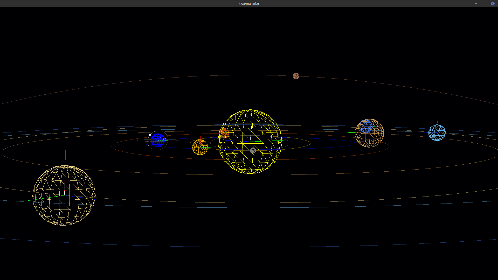

# openGL_sonne

C code to render a solar system (8 planets + Pluto) including camera movement (WASDQE to move, +- for zoom) and telescope mode (F1 to activate, right click + arrow keys to move).

   ```bash
gcc -o solar solar.c planeta.c camara.c -lGL -lGLU -lglut -lm
   ```

